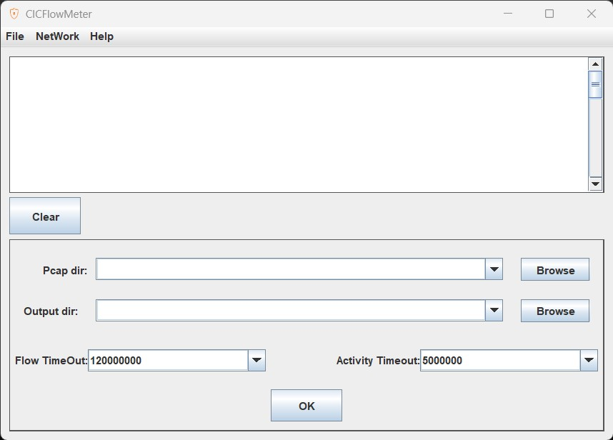
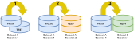
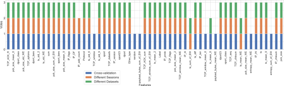
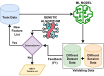

# IoTGeM: Generalisable Models for Behaviour-Based IoT Attack Detection.

# Overview
In this repository you will find a Python implementation of the methods in the paper [IoTGeM: Generalisable Models for Behaviour-Based IoT Attack Detection](https://arxiv.org/abs/2401.01343)


# What is IoTGeM?

The Internet of Things is becoming more and more involved in our daily lives. In parallel with this, IoT is the target of many cyber attacks. Due to IoT's heterogeneous nature and unusual interfaces, the solutions used in classical instruments may not be suitable. This paper proposes a generalisable intrusion detection model based on machine learning. While building this model, we propose a sliding and expanding window-oriented feature set that can detect attacks earlier and with higher performance. We also compare our method with alternatives. In the feature selection phase, we use a genetic algorithm based on external feedback to generate the optimal feature set combination. In order to demonstrate the generalisability of our results, we present our results by comparing the models we have developed with isolated attack data.

# Requirements and Infrastructure: 

Wireshark and Python 3.6 were used to create the application files. Before running the files, it must be ensured that [Wireshark](https://www.wireshark.org/), [Python 3.6+](https://www.python.org/downloads/) and the following libraries are installed.

| Library | Task |
| ------ | ------ |
|[ Scapy ](https://scapy.net/)| Packet(Pcap) crafting |
|[ tshark ](https://www.wireshark.org/)| Packet(Pcap) crafting |
|[ Sklearn ](http://scikit-learn.org/stable/install.html)| Machine Learning & Data Preparation |
| [ Numpy ](http://www.numpy.org/) |Mathematical Operations|
| [ Pandas  ](https://pandas.pydata.org/pandas-docs/stable/install.html)|  Data Analysis|
| [ Matplotlib ](https://matplotlib.org/users/installing.html) |Graphics and Visuality|
| [Seaborn ](https://seaborn.pydata.org/) |Graphics and Visuality|


The technical specifications of the computer used for experiments are given below.

|  | |   |
| ------ |--|  ------ |
|Central Processing Unit|:|Intel(R) Core(TM) i7-7500U CPU @ 2.70GHz 2.90 GHz|
| Random Access Memory	|:|	8 GB (7.74 GB usable)|
| Operating System	|:|	Windows 10 Pro 64-bit |
| Graphics Processing Unit	|:|	AMD Readon (TM) 530|

# Implementation: 

The implementation phase consists of 5 steps, which are:

* Feature Extraction
* Feature Selection 
* Algorithm Selection 
* Performance Evaluation
* Comparison with Previous Work


Each of these steps is implemented using one or more Python files. The same file was saved with both "py" and "ipynb" extensions. The code they contain is exactly the same. The file with the ipynb extension has the advantage of saving the state of the last run of that file and the screen output. Thus, screen output can be seen without re-running the files. Files with the ipynb extension can be run using [jupyter notebook](http://jupyter.org/install). 

## Datasets
The datasets we used in our study are listed below.

| Dataset | capture year | Number of Devices | Number of Attacks  |
|---|---|---|---|
|[CIC-IoT-2022](https://www.unb.ca/cic/datasets/iotdataset-2022.html)| 2022|40|4|
|[BoT-IoT](https://research.unsw.edu.au/projects/bot-iot-dataset)| 2018|5|10|
|[Edge-IIoT](https://ieee-dataport.org/documents/edge-iiotset-new-comprehensive-realistic-cyber-security-dataset-iot-and-iiot-applications)| 2022|9|13|
|[IoT-ENV](https://ocslab.hksecurity.net/Datasets/iot-environment-dataset)| 2021|5|3|
|[IoT-NID](https://ocslab.hksecurity.net/Datasets/iot-network-intrusion-dataset)|2019|2|10|
|[Kitsune](https://www.kaggle.com/datasets/ymirsky/network-attack-dataset-kitsune)| 2019|9|9|
|[MazeBolt](https://kb.mazebolt.com/kbe_taxonomy/ddos-general/)|NA|NA|NA|


We used these datasets for different purposes at different stages of our study. Table 1 indicates which part of the dataset and for what purpose it was used in our study.



<p style="text-align: center;">Table 1 - The datasets used in the study and their usage purposes.</p>


## 1- Feature Extraction (PCAP2CSV) 

### 1.1- Individual and Window based Features
This section uses the [pcap2csv](https://github.com/kahramankostas/HerIoT/blob/main/0001%20Feature%20Extraction%20-%20PCAP2CSV/001%20-%20Features_Extraction%20(pcap%202%20end).ipynb) tool to extract features from pcap files. Packet-level labels are required for labelling. Some datasets have packet-based labels (such as Kitsune). If you have labels, save them with the same name as the pcap file (such as example.pcap & example.csv). The *pcap2csv* file will transfer the labels to *CSV* during the feature extraction process. 

If you do not have packet-level labels, the LabelMaker file will generate them from the *pcap* file. To do this, simply add the [WireShark](https://www.wireshark.org/) rules for identifying attacks to the [dataset_description.csv](https://github.com/kahramankostas/HerIoT/blob/main/0001%20Feature%20Extraction%20-%20PCAP2CSV/dataset_description.csv) file (see Fig.1).


<p style="text-align: center;">Fig. 1 - Pcap file labelling with LabelMaker</p>


### 1.2- Flow-based features

For flow-based feature extraction, we used [CICFlowMeter](https://www.unb.ca/cic/research/applications.html) (see Fig.2), a tool that quickly converts pcap files into flow-based features as CSV files. For labelling, most of the databases provide their own labelled CSV files. You can use these labels. We have used a python script to import the labels of some datasets into these files. You can find a few examples of how we did this in the [FLOW-LABELLER.ipynb](https://github.com/kahramankostas/HerIoT/blob/main/0001%20Feature%20Extraction%20-%20PCAP2CSV/000%20-%20FLOW-LABELLER.ipynb) file.



<p style="text-align: center;">Fig. 2 - CICFlowMeter V3 user interface. </p>
 

## 2- Feature Selection


In this step, we aimed to obtain the most appropriate feature set by feature selection. We applied feature selection with feature reduction and genetic algorithm respectively.

### 2.1- Feature Reduction

[02.1 Feature_reduction.ipynb](https://github.com/kahramankostas/HerIoT/blob/main/0002%20Feature%20Selection/Window/02.1%20Feature_reduction.ipynb): We applied a 3-step voting method for feature reduction. 
In this method, each feature is used individually in machine learning on 3 different data sets. If the success of this feature in terms of kappa is greater than 0, one vote is given to this feature in that step.
These three steps can be summarised as follows.

 - Using a cross-validated session as training and test.
 - Using one of the two sessions as test and the other as training data
 - Using data from two different datasets as training and testing.

This process is visualised in the Fig.3.


<p style="text-align: center;">Fig. 3 - Data for three step feature reductuin. </p>

Of these three steps, the feature with at least two votes is used in the next step, provided that it receives votes from the last step. Features that do not meet this requirement are discarded.  An example voting process is given in Fig. 4.


<p style="text-align: center;">Fig. 4 -Voting process during the feature elimination step for the Host Discovery attack. </p>


### 2.1- Feature Selection With GA
[02.2 GA_feature_selection.ipynb](https://github.com/kahramankostas/IoTGeM/blob/main/0002%20Feature%20Selection/Window/02.2%20GA_feature_selection.ipynb): In this step, a feature selection is performed using examples of the same attack on different datasets. The model is trained using the feature set generated by the genetic algorithm and the first dataset. This model is tested with a second dataset and the result of this test is given as feedback to the genetic algorithm. This process is repeated 25 times. The process is visualised in the Fig. 5. 



<p style="text-align: center;">Fig. 5 Feature selection using the genetic algorithm with external feedback </p>

## 03 Algorithm Selection
[03.1 Hyperparameter Optimization](https://github.com/kahramankostas/IoTGeM/blob/main/0003%20Performance%20Evaluation/window/Hyperparameter%20Optimization.ipynb):  In this file, hyperparameter optimization is applied via sklearn-Randomizedsearch to the machine learning models being used. These machine learning models are:

- Logistic Regression (LR)
- Decision Tree (DT)
- Naive Bayes (NB)
- Support Vector Machine (SVM)
- Random Forrest (RF)
- Extreme Gradient Boosting (XGboost)
- K-Nearest Neighbors (KNN)
- Multilayer Perceptron (MLP)

## 04 Performance Evaluation
[03.2 ML-MAIN-group.ipynb](https://github.com/kahramankostas/IoTGeM/blob/main/0003%20Performance%20Evaluation/window/ML-MAIN-group.ipynb):
In this step, a 3-stage evaluation process is performed. The test data used in steps 2 and 3 of this process are isolated data sets. They have not been used in any previous step.

 - Using a cross-validated session as training and test.
 - Using one of the two sessions as testing and the other as training data.
 - Using data from two different datasets as training and testing.


# License
This project is licensed under the MIT License - see the [LICENSE](LICENSE) file for details


# Citations
If you use the source code please cite the following paper:

*Kahraman  Kostas,  Mike  Just,  and  Michael  A.  Lones.   IoTGeM:  Generalisable Models for Behaviour-Based IoT Attack Detection, arXiv preprint, arxiv:x.x, 2023.*


```
@misc{kostas2023IoTGeM,
      title={{IoTGeM}: Generalisable Models for Behaviour-Based {IoT} Attack Detection}, 
      author={Kahraman Kostas and Mike Just and Michael A. Lones},
      year={2023},
      eprint={2401.01343},
      archivePrefix={arXiv},
      primaryClass={cs.CR}
}
```

Contact:
*Kahraman Kostas
kahramankostas@gmail.com*
